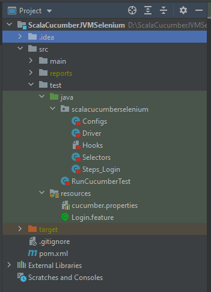

# ScalaCucumberJVMSelenium
This repo has the code which implements a Selenium Test framework using BDD (Cucumber-JVM) and Scala for the website, https://www.saucedemo.com/

Project setup guide is available in the PDF doc [ScalaCucumberJVMSelenium.pdf](ScalaCucumberJVMSelenium.pdf)

### **Folder Structure**

